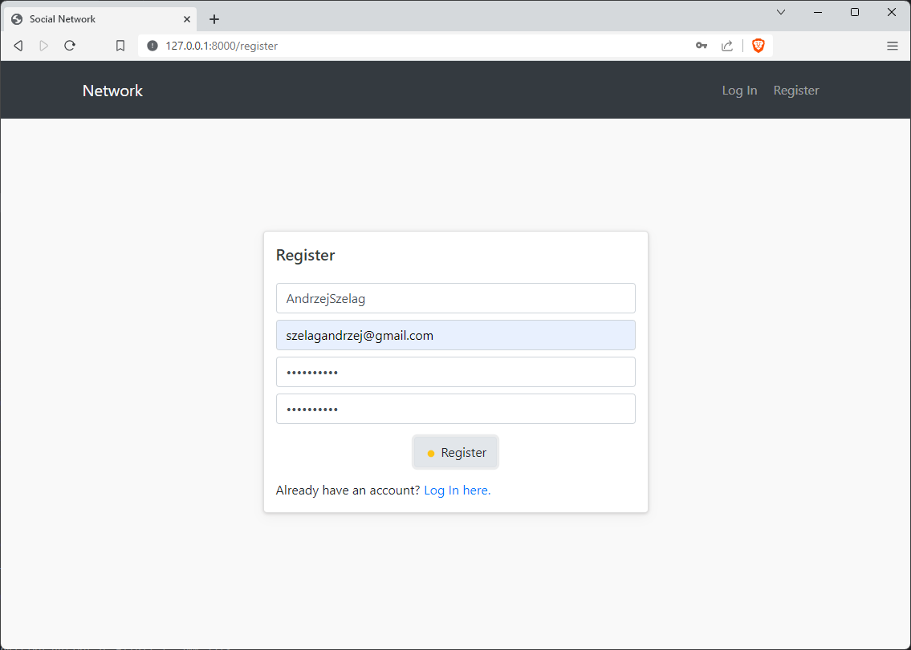
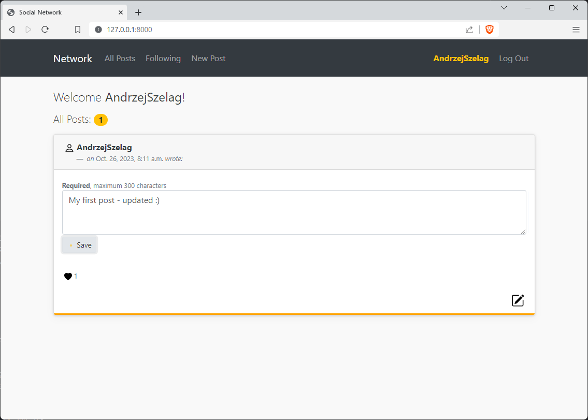
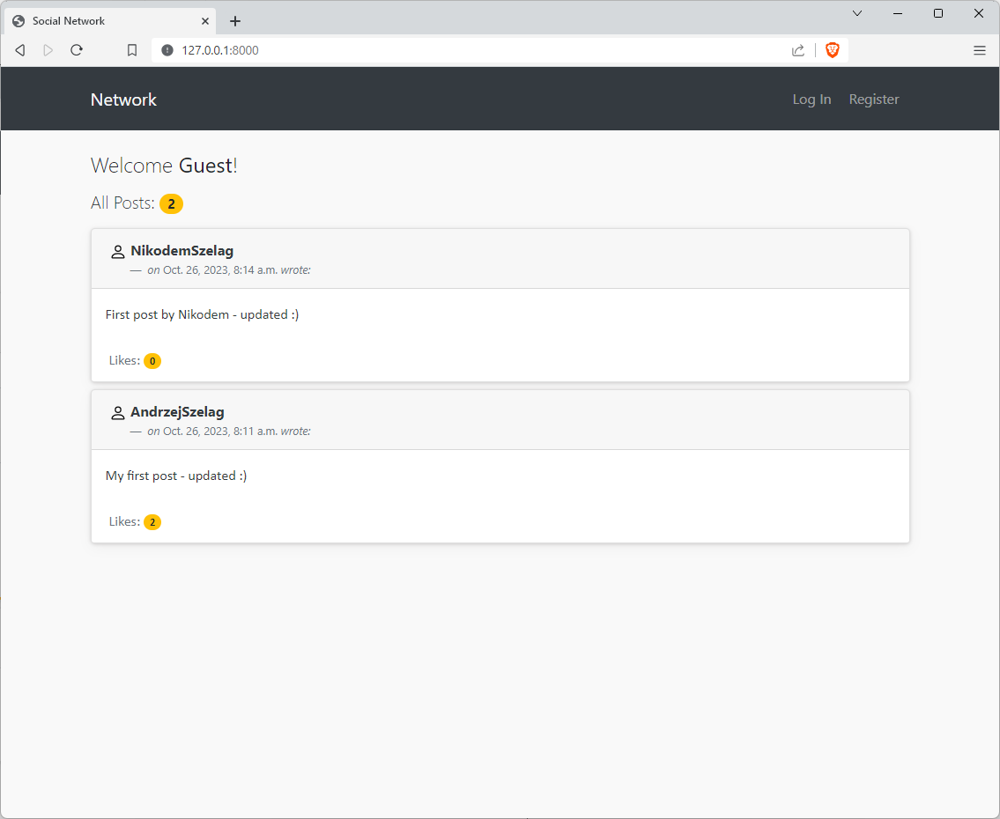
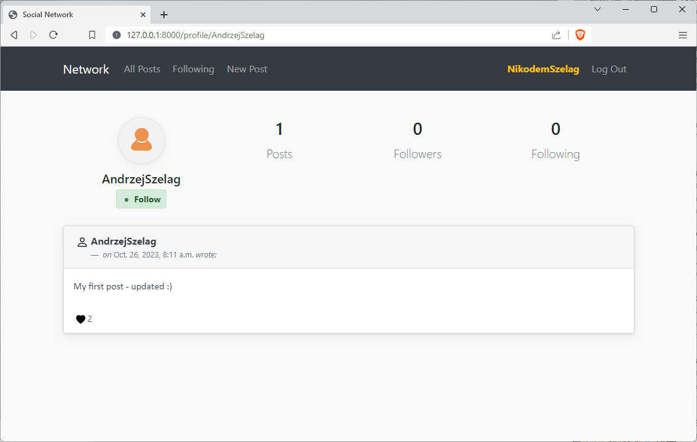
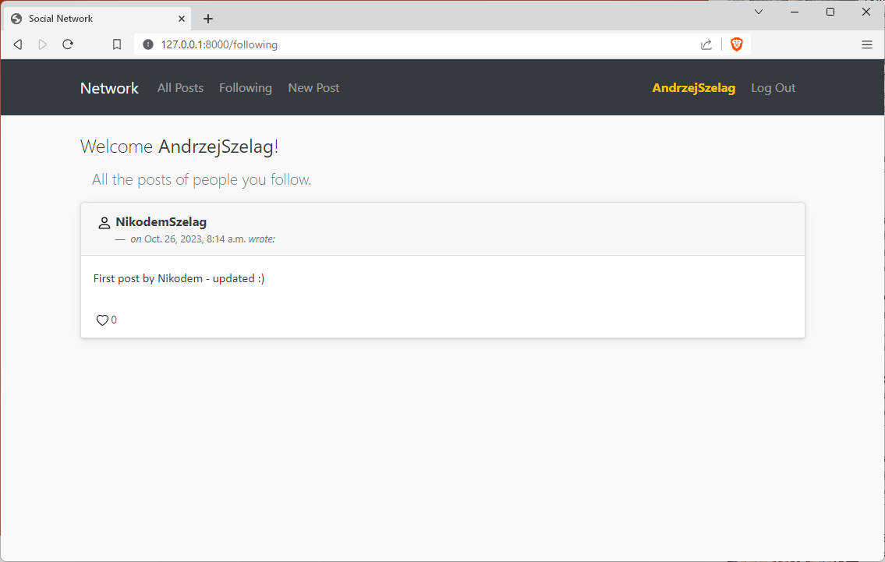
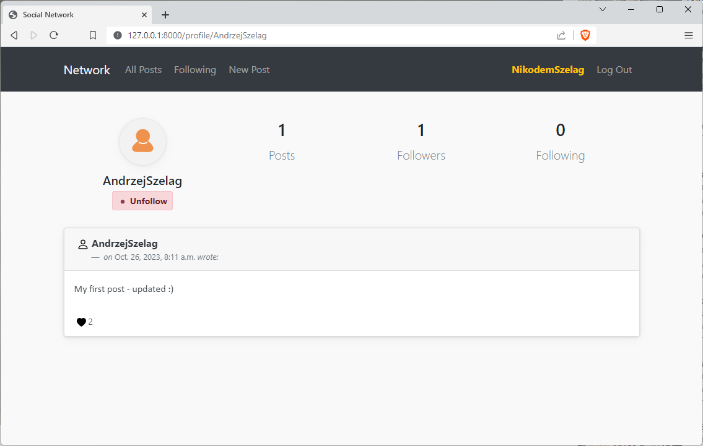

# Network

#### 📘 Project 4 from Edx | Harvard CS50's Web Programming with Python and JavaScript Course
✒️ Design a Twitter-like social network website for making posts and following users.

### Specification

🚀 https://cs50.harvard.edu/web/2020/projects/4/network/

### Video

🚀 [Network project on YouTube](https://youtu.be/tz38JFWBWDY)

### Requirements

* Python 3.11.1
* Django 4.1.4 (if you have a _requirements.txt_ file type this command: __python -m pip install -r requirements.txt__)

### How to run? 
1. Go to the directory which contains "__manage.py__" file
2. Then type this command: __python manage.py runserver__
3. In your Web browser use a URL: __http://127.0.0.1:8000/__
